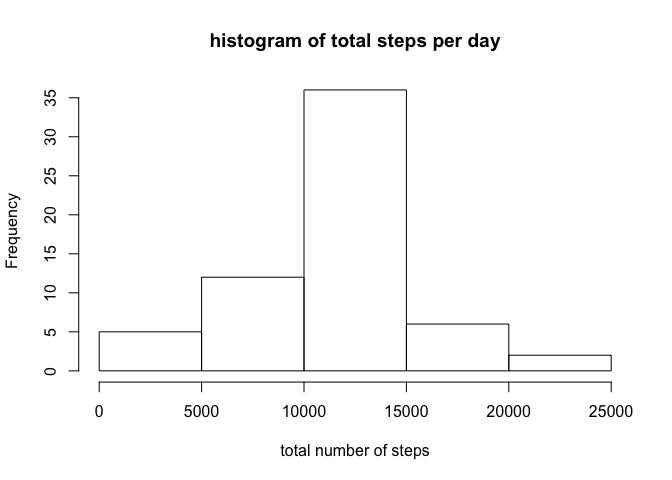

# Reproducible Research: Peer Assessment 1
This assignment makes use of data from a personal activity monitoring device. This device collects data at 5 minute intervals through out the day. The data consists of two months of data from an anonymous individual collected during the months of October and November, 2012 and include the number of steps taken in 5 minute intervals each day.

## Loading and preprocessing the data

Firstly read activity data into R, and remove those missing values.


```r
activity <- read.csv("activity.csv", header=T, stringsAsFactors =F)
data <- na.omit(activity)
```

## What is mean total number of steps taken per day?

Use **aggregate( )** to calculate total number of steps taken each day and draw a histogram using **hist( )**.

Use **mean( )** and **median( )** to find the mean and median total number of steps taken per day.

mean = 10766.19  median = 10765 


```r
date_total <- aggregate( steps ~ date, data = data, FUN = sum)
hist(date_total$steps, xlab="total number of steps", main="histogram of total steps per day")
```

 

```r
date_mean <- mean(date_total$steps)
date_median <- median(date_total$steps)
date_mean
```

```
## [1] 10766.19
```

```r
date_median
```

```
## [1] 10765
```

## What is the average daily activity pattern?

Get a time series plot of the 5-minute interval (x-axis) and the average number of steps taken, averaged across all days (y-axis). 

The **835th** 5-minute interval, on average across all the days in the dataset, contains the maximum number of steps.


```r
interval_mean <- aggregate( steps ~ interval, data = data, FUN = mean)
plot(interval_mean$steps, type="l", xlab="5-minute interval", ylab="number of steps", main="daily activity")
```

 

```r
interval_mean[which(interval_mean$steps == max(interval_mean$steps)),]
```

```
##     interval    steps
## 104      835 206.1698
```

## Imputing missing values
Use is.na( ) and sum( ) to find and calulate the total number of missing values. There are **2304** missing values in the dataset. 


```r
sum(is.na(activity$steps))
```

```
## [1] 2304
```

If a given 5-minute interval has missing value, impute it with the average value of that interval across all dates. Name the imputed dataset as **data_imputed**.


```r
library("plyr")
impute_value <- join(activity, interval_mean, by="interval")
impute_value$steps[is.na(impute_value$steps)] <- impute_value[is.na(impute_value$steps),4]
data_imputed <- impute_value[,1:3]
```

Use **aggregate( )** to calculate total number of steps taken each day for that imputed dataset and draw a histogram using **hist( )**.

Use **mean( )** and **median( )** to find the mean and median total number of steps taken per day.

mean = 10766.19  median = 10766.19

The mean value didn't change, but the median value increased after imputing.


```r
date_total_imputed <- aggregate( steps ~ date, data = data_imputed, FUN = sum)
hist(date_total_imputed$steps, xlab="total number of steps", main="histogram of total steps per day")
```

 

```r
date_mean_imputed <- mean(date_total_imputed$steps)
date_median_imputed <- median(date_total_imputed$steps)
date_mean_imputed
```

```
## [1] 10766.19
```

```r
date_median_imputed
```

```
## [1] 10766.19
```

## Are there differences in activity patterns between weekdays and weekends?

Use **weekdays( )** to create a new variable named day with two levels -- "weekday" and "weekend" indicating whether a given date is a weekday or weekend day.


```r
weekday <- c('Monday', 'Tuesday', 'Wednesday', 'Thursday', 'Friday')
data_imputed$day <- ifelse(weekdays(as.Date(data_imputed$date)) %in% weekday, 'weekday', 'weekend')
```

Make a panel plot containing a time series plot of the 5-minute interval (x-axis) and the average number of steps taken, averaged across all weekday days or weekend days (y-axis). The result shows two plots as weekdays and weekends separately.


```r
avg_data_imputed <- aggregate(steps ~ interval + day, data=data_imputed, mean)
library("lattice")
xyplot(steps ~ interval | day, avg_data_imputed, index.cond=list(c(2,1)),type="l", lwd=1, xlab="5-minute interval", ylab="average number of steps", layout=c(1,2))
```

 
